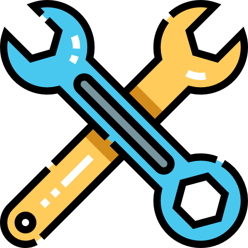
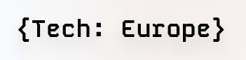

<p align="center">
  
</p>

# Prepair

An AI-powered procurement agent for tradespeople that analyzes job requirements, identifies inventory gaps, and autonomously sources materials from local suppliers.

**Built in one day for the [TechEurope](https://www.linkedin.com/company/tech-europe-community/) London AI Hackathon 2025.**

<p align="center">
  
</p>

## Overview

Prepair helps tradespeople stay prepared by automating the procurement process. The AI agent identifies missing tools and materials for upcoming jobs, then autonomously calls local suppliers to check availability and arrange collection.

## The Agent

### How It Works

1. **Gap Analysis**: The agent analyzes your scheduled jobs against current inventory to identify missing materials and tools
2. **Decision Point**: If everything is available, you're confirmed ready. If items are missing, the procurement agent activates
3. **Procurement Agent**:
   - Uses voice interaction to understand your specific requirements
   - Searches for local suppliers prioritized by proximity to your job sites
   - Autonomously calls stores to check availability and book collection slots
4. **Confirmation**: Once materials are secured, you're confirmed ready to work

### Technology Stack

The agent integrates three key technologies:

- **[LiveKit](https://livekit.io/)**: Provides real-time voice agent capabilities for natural conversations with tradespeople
- **[Valyu](https://valyu.ai/)**: AI-powered search to discover and prioritize local suppliers based on job location
- **[ElevenLabs](https://elevenlabs.io/)**: Conversational AI for autonomous phone calls to suppliers

### Agent Architecture

The agent uses the Model Context Protocol (MCP) to connect LiveKit with backend services:

```
User (Tradesperson)
    ↓
LiveKit Voice Agent
    ↓
MCP Tools Layer
    ├─→ Valyu Search (find suppliers)
    └─→ ElevenLabs Agent (call suppliers)
    ↓
Procurement Complete
```

### Development Status

The agent is currently in early development. The core architecture has been designed, and the technology stack selected. Implementation is ongoing.

**Current Status**: Planning and architecture phase
**Next Steps**:
- Set up LiveKit voice agent
- Integrate Valyu search API
- Implement ElevenLabs calling agent
- Build MCP tool connectors

## Presentation

A React-based visualization of the Prepair workflow is available in the `presentation/` directory.

To run the presentation:

```bash
cd presentation
npm install
npm run dev
```

Then open your browser to the local development server (typically http://localhost:5173).

## Project Structure

```
prepair/
├── agent/          # AI agent implementation (in development)
│   └── Agent.md    # Agent architecture notes
├── presentation/   # React workflow visualization
└── CLAUDE.md       # Development guide for Claude Code
```

## About

This project was built in one day for the [TechEurope](https://www.linkedin.com/company/tech-europe-community/) London AI Hackathon 2025, demonstrating how AI agents can solve real-world problems for tradespeople by automating time-consuming procurement tasks.
